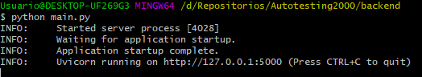
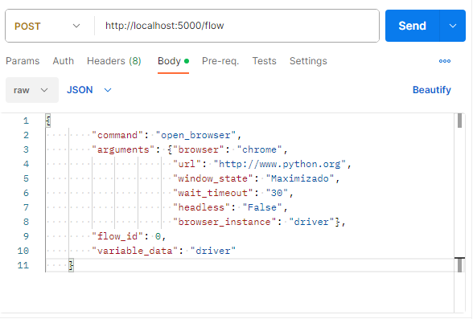

PASOS PARA ARRANCAR EL BACK

1- Tener instaldo python

2- Crear un entorno virtual

Desde una consola bash ubicado en la carpeta del proyecto hacemos:

`python -m venv venv`

Luego activar en entorno virtual

`. venv/Scripts/activate`

Instalar las dependencias

`pip install -r requirements.txt`
	
Inicializar la aplicacion

`python main.py`

Si se ve asi es porque inicio bien

El mismo proyecto tiene un swagger http://127.0.0.1:5000/docs
donde podemos probar el correcto funcionamiento
vamos al POST /flow hacemos click a la derecha en el boton "try it out"
y pegamos el siguiente ejemplo
`{
        "command": "open_browser",
        "arguments": {"browser": "chrome",
                      "url": "http://www.python.org",
                      "window_state": "Maximizado",
                      "wait_timeout": "30",
                      "headless": "False",
                      "browser_instance": "driver"},
        "flow_id": 0,
        "variable_data": "driver"
    }`
esto deberia abrir un navegador chrome

tambien podriamos hacer lo mismo desde el postman

creando un nuevo request que sea de tipo POST
a la url http://localhost:5000/flow

colocando en el body el mismo ejemplo que mensionamos antes.
RECORDATORIO: cuando hacemos click en el body tenemos que seleccionar el tipo RAW con formato JSON

